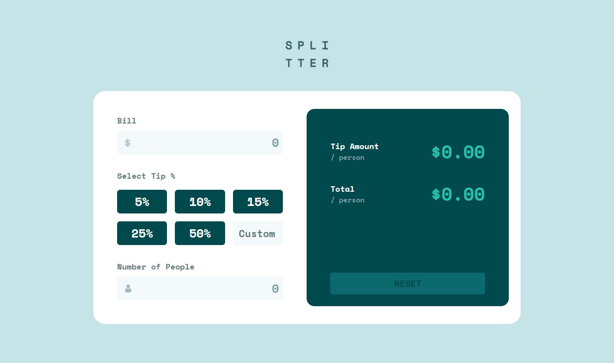
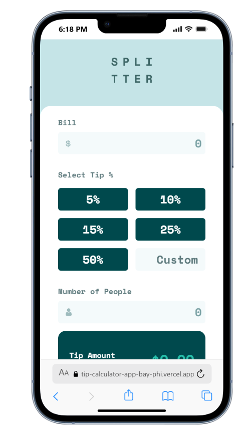

# Frontend Mentor - Tip calculator app solution

This is a solution to the [Tip calculator app challenge on Frontend Mentor](https://www.frontendmentor.io/challenges/tip-calculator-app-ugJNGbJUX). Frontend Mentor challenges help you improve your coding skills by building realistic projects.

## Table of contents

- [Overview](#overview)
  - [The challenge](#the-challenge)
  - [Screenshot](#screenshot)
  - [Links](#links)
- [My process](#my-process)
  - [Built with](#built-with)
  - [What I learned](#what-i-learned)
  - [Continued development](#continued-development)
  - [Useful resources](#useful-resources)
  - [AI Collaboration](#ai-collaboration)
- [Author](#author)
- [Acknowledgments](#acknowledgments)

**Note: Delete this note and update the table of contents based on what sections you keep.**

## Overview

This challenge was very difficult for me. It was very new and the tools used were unfamiliar for me. It is the first JavaScript project I have done with manipulation of DOM and interactive color states and active states. It took me a lot of work, and lots of reading and searching on MDN to understand the different commands needed to interact with the DOM. I was able to figure it out, with the exception of a few minor bugs. (The border around the custom box is still glitchy) I learned a lot with this activity.

### The challenge

Users should be able to:

- View the optimal layout for the app depending on their device's screen size
- See hover states for all interactive elements on the page
- Calculate the correct tip and total cost of the bill per person

### Screenshot





### Links

- Solution URL: [https://github.com/auntfunny/Tip_Calculator_App](https://github.com/auntfunny/Tip_Calculator_App)
- Live Site URL: [https://tip-calculator-app-bay-phi.vercel.app/](https://tip-calculator-app-bay-phi.vercel.app/)

## My process

I first built the HTML, and then did the CSS Tailwind design for the mobile version. After that I made the ajustments for the desktop version as well. Then I started to work on the JavaScript. I made the buttons work first, that there was only one active button at a time and they displayed the correct value. Then I worked on the logic, and recieving the variables in the correct form took me a lot of work. After I had the correct values, and they were shown in the website, I worked on the formating changes, and I spent a long time trying to get the active states of the reset button and the custom tip box to work right. I also had to try lots of different methods to get the outputs to show as money amounts like I wanted.

### Built with

- Semantic HTML5 markup
- CSS custom properties
- Flexbox
- CSS Grid
- Mobile-first workflow
- CSS Tailwind
- JavaScript


### What I learned

I learned a LOT in this activity, because it had a lot of parts that I had never worked with before. I learned how to manipulate the DOM and how to change class lists and hide and show elements. It took a lot of work to get all of the functions working like I wanted, but I was able to complete the task in the end. I think the part that I struggled with the most was configuring the Reset button to turn off when the calculator was empty, especially with the Custom Tip Box. For a long time it wouldn't work for me, but I eventually was able to make it work (almost) right. It still has a couple of bugs, like when you put in a value greater than 10 and then erase a digit, it turns off even if the box isn't empty.

```js
  let resetButtonColorToggle = 0;
  if (tipPercent != 0) {
    resetButtonColorToggle = 1;
  }

  if (
    totalPeople === 0 &&
    tipPercent === 0 &&
    billToPay === 0 &&
    resetButtonColorToggle != 0
  ) {
    clearAllButton.classList.toggle("bg-accInactive");
    clearAllButton.classList.toggle("bg-accGreen1");
    buttonToggle = 0;
    resetButtonColorToggle = 0;
  } else if (buttonToggle === 0 && resetButtonColorToggle != 0) {
    clearAllButton.classList.toggle("bg-accInactive");
    clearAllButton.classList.toggle("bg-accGreen1");
    buttonToggle = 1;
    resetButtonColorToggle = 0;
  } else if (
    buttonToggle === 1 &&
    tipPercent < 10 &&
    event.target !== fivePercentButton
  ) {
    clearAllButton.classList.toggle("bg-accInactive");
    clearAllButton.classList.toggle("bg-accGreen1");
    buttonToggle = 0;
    resetButtonColorToggle = 0;
  }
```
I used this set of conditionals to try to configure it correctly, but the last one still has issues, and I don't know how to figure it out.


### Continued development

I want to continue to improve my logic and my syntax in JavaScript. I also need to learn more of the language and the specific commands available to be able to create more concise code. I feel like although my code works, it is inefficient and difficult to read, and there are probable much better ways to organize and fix my code.

### Useful resources

- [MDN](https://developer.mozilla.org/en-US/) - I had to look up lots of functions and commands and read about them on MDN. It helped me to be able to complete this project.


## Author

- Website - [Anthony Black](https://anthonyblack.vercel.app/index.html)
- Frontend Mentor - [@auntfunny](https://www.frontendmentor.io/profile/auntfunny)
- GitHub - [@auntfunny](https://github.com/auntfunny)


